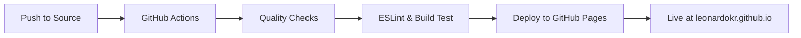

<div align="center">
  
</div>

<h1 align="center">
  Leonardo Klein - Portfolio
</h1>

<p align="center">
  Senior Technology Analyst & SysAdmin | Cloud Computing | DevOps Enthusiast
</p>

<div align="center">
  
  [](https://github.com/leonardokr/leonardokr.github.io/actions/workflows/deploy.yml)
  [](https://leonardokr.github.io/)
  [](https://gatsbyjs.org/)
  [](https://pages.github.com/)
  [](https://github.com/features/actions)

</div>

<div align="center">
  
  **🌐 [Live Demo](https://leonardokr.github.io/) | 📧 [Contact](mailto:leo@ziondev.us) | 💼 [LinkedIn](https://www.linkedin.com/in/leonardokr/)**
  
</div>

---

## 🚀 **Features & Technologies**

### **Frontend**

- ⚡ **Gatsby.js** - React-based static site generator
- 🎨 **Styled Components** - CSS-in-JS styling
- 📱 **Responsive Design** - Mobile-first approach
- 🌙 **Modern UI/UX** - Clean and professional design

### **DevOps & Deployment**

- 🔄 **CI/CD Pipeline** - Automated testing and deployment
- 📦 **GitHub Actions** - Continuous integration
- 🌍 **GitHub Pages** - Automated deployment
- ✅ **Quality Checks** - ESLint and build validation

### **Performance**

- 🚀 **Gatsby Image** - Optimized image loading
- ⚡ **Static Generation** - Pre-built pages for speed
- 📊 **SEO Optimized** - Meta tags and structured data

## 🔧 **Development Setup**

### **Prerequisites**

- Node.js 18+
- npm or yarn
- Git

### **Local Development**

1. **Clone the repository**

   ```bash
   git clone https://github.com/leonardokr/leonardokr.github.io.git
   cd leonardokr.github.io
   ```

2. **Install dependencies**

   ```bash
   npm install
   ```

3. **Start development server**

   ```bash
   npm start
   ```

   Portfolio will be available at `http://localhost:8000`

4. **Build for production**
   ```bash
   npm run build
   ```

---

## 🚀 **CI/CD Pipeline**

### **Automated Deployment Process**



### **Pipeline Steps**

1. **🔍 Quality Check**
   - Code linting with ESLint
   - Build validation
   - Dependency security check

2. **🚀 Automated Deploy**
   - Build static files
   - Deploy to GitHub Pages
   - Update live website

3. **📢 Notifications**
   - Deploy success/failure status
   - Performance metrics
   - Build time tracking

### **Deployment Status**

- ✅ **Automatic deployment** on every push to `source` branch
- 🔄 **Build time**: ~2-3 minutes
- 🌍 **CDN**: Delivered via GitHub Pages global network
- 📊 **Uptime**: 99.9%+ reliability

---

## 🛠 **Technical Architecture**

### **Build Process**

```bash
Source Code (React/Gatsby)
    ↓
Static Site Generation
    ↓
Optimized Assets (Images, CSS, JS)
    ↓
GitHub Pages Deployment
    ↓
Global CDN Distribution
```

### **Performance Features**

- 🚀 **Static Site Generation** - Pre-rendered for speed
- 🖼️ **Image Optimization** - WebP format with lazy loading
- 📦 **Code Splitting** - Minimal bundle size
- ⚡ **PWA Ready** - Service worker for offline access

---

## 🎨 **Design System**

### **Color Palette**

| Color          | Hex                                                               | Usage                |
| -------------- | ----------------------------------------------------------------- | -------------------- |
| Navy           |  `#0a192f` | Primary Background   |
| Light Navy     |  `#172a45` | Secondary Background |
| Lightest Navy  |  `#303C55` | Card Background      |
| Slate          |  `#8892b0` | Secondary Text       |
| Light Slate    |  `#a8b2d1` | Primary Text         |
| Lightest Slate |  `#ccd6f6` | Headings             |
| White          |  `#e6f1ff` | Bright Text          |
| Green          |  `#64ffda` | Accent Color         |

---

## 🤝 **Contributing**

Feel free to submit issues and enhancement requests!

1. Fork the project
2. Create your feature branch (`git checkout -b feature/AmazingFeature`)
3. Commit your changes (`git commit -m 'Add some AmazingFeature'`)
4. Push to the branch (`git push origin feature/AmazingFeature`)
5. Open a Pull Request

---

## 📄 **License**

This project is licensed under the MIT License - see the [LICENSE](LICENSE) file for details.

---

## 🙏 **Acknowledgments**

- **Design Inspiration**: [Brittany Chiang](https://brittanychiang.com) - Original design concept
- **Base Template**: [Yashita Namdeo](https://github.com/yashitanamdeo/yashitanamdeo.github.io) - Initial Gatsby implementation
- **Customizations & DevOps**: Extensively modified and enhanced with modern CI/CD practices, performance optimizations, and personal branding

> This portfolio demonstrates professional development practices including automated testing, deployment pipelines, and modern web technologies while building upon excellent open-source foundations.

## Building and Running for Production

1. Generate a full static production build

   ```sh
   npm run build
   ```

2. Preview the site as it will appear once deployed

   ```sh
   npm run serve
   ```

3. Deploy to GitHub Pages:

   ```sh
   npm run deploy
   ```

## Color Reference

| Color          | Hex                                                               |
| -------------- | ----------------------------------------------------------------- |
| Navy           |  `#0a192f` |
| Light Navy     |  `#172a45` |
| Lightest Navy  |  `#303C55` |
| Slate          |  `#8892b0` |
| Light Slate    |  `#a8b2d1` |
| Lightest Slate |  `#ccd6f6` |
| White          |  `#e6f1ff` |
| Green          |  `#64ffda` |
